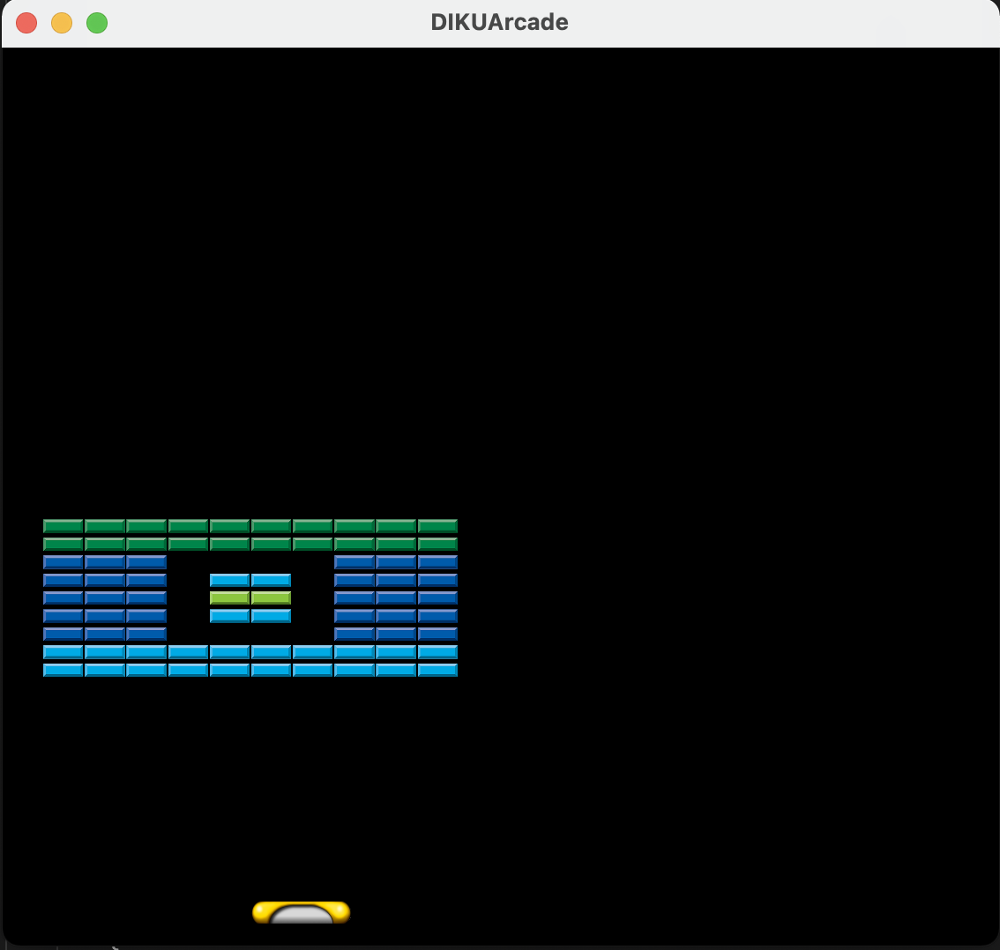

# DIKUGames
Repository for solving assignments with DIKUArcade for the DIKU course Software Development.

## About
This repository concerns the development of the game Breakout using the DIKUArcade engine. Breakout is a classic single-player game originally from the Atari Console. The game involves a ball bouncing around the screen, destroying blocks it collides with. The goal is to clear as many blocks as possible without letting the ball exit through the bottom of the screen. The player prevents this by blocking the ball from exiting, usually by using the arrow keys to move the player character from left to right. Additional features like different block types and power-ups are also implemented in this project.

## Installation
To start working on the assignments, follow the instructions in the assignment description to create a **duplication** of this repository.

## Implementation
The game is written in C# and the code can be found on GitHub: [DIKUGames Repository](https://github.com/beto1414/DIKUGames). The implementation uses DIKUArcade as a tool/engine, which helps in implementing features and reducing the amount of code needed.

### Features
- Different block types and power-ups.
- Level loaded from a file containing an ASCII layout, a list of legends, and a list of metas.
- Efficient memory usage by discarding unnecessary information after level instantiation.

### Evaluation
The game is currently instantiated with a given level, and there is no way for the player to change the level. This is a limitation as it is hardcoded in the code, making it inaccessible for a user to change levels. The CreateLevel class uses additional classes to load the map, which might be inefficient for larger scales than a 12x25 grid. Also, the communication between classes could be optimized to reduce unnecessary calls.

Although new implementations work as intended, there are some bugs and quality flaws. For instance, each change of ball direction has to be done twice whenever the ball's direction should be changed. Also, the tests are not compatible with MacOS due to DIKUArcade's incompatibility with MacOS. Furthermore, there are performance issues as the computer testing the game overheats while running the game. However, since this project focuses on design and not performance, this is not seen as an immediate issue. The code quality and performance are expected to be improved in the future.

## Requirements
- Level should be loaded from a file containing an ASCII layout, a list of legends, and a list of metas.
- The ASCII map determines how the blocks should be placed and what kind of block they each should be.
- The list of legends contains information on how the blocks should look according to the ASCII map.
- The list of metas contains information on the environment of the game, such as time and block types.

## Contributing
Contributions are welcome! Please read the [contributing guidelines](CONTRIBUTING.md) before getting started.

## License
This project is licensed under the MIT License - see the [LICENSE](LICENSE) file for details.
